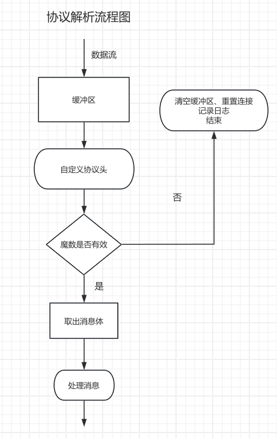

# 协议解析设计

## 协议解析流程图

## 缓冲区、协议头生命周期设计

### TCP协议的流式数据特性

由于 TCP 协议是流式数据传输，数据可能会被拆分成多个片段接收，可能是：
- 一个完整的消息
- 一个消息拆分成多个 TCP 包（**拆包**）
- 多个消息合并到一个 TCP 包中（**粘包**）

### 缓冲区的生命周期设计

考虑以下几个方面：

- **数据存储**：当接收到的数据不完整时，需存储数据，等待后续数据补全，确保可靠传输。
- **初始化与清空**：
  - 缓冲区在 `NetworkManager` 初始化时创建，并会一直存在，直到网络关闭。
  - 在处理完完整消息后，清空已处理部分。
  - 在魔数验证失败或解析错误时，应清空缓冲区，避免数据污染。
- **数据解析**：
  - 解析过程中，缓冲区存储的数据会被部分消耗。
  - 未解析的部分继续保留，等待后续数据到达。

### 协议头的生命周期设计

协议头的作用：描述消息的基本信息，如 **魔数、版本、消息类型、消息体积、CRC 校验**，用于指导消息体的解析。

设计考虑：

- **初始化与销毁**：
  - 在每个数据包开始解析时初始化。
  - 解析完成后销毁，因为每个数据包的协议头都是唯一的。
- **及时更新**：
  - 每次解析消息时，当前协议头都会被更新，始终代表当前正在解析的数据包。

### 总结

- **缓冲区**：设计为 **成员变量**，全程存在。
- **协议头**：设计为 **临时变量**，解析过程中动态更新。

---

## 解析数据时的方案设计

### 直接判断缓冲区大小 vs 解析标志位

**疑问**：既然协议头包含魔数和标准语义化控制版本，为什么解析过程中还需要使用标志位判断头部？

**核心原因**：TCP 的 **拆包问题**。

TCP 是流式传输，数据包的边界不固定。当缓冲区内容小于协议头时，可能出现以下情况：

- **拆包问题**：当前缓冲区数据可能是上个消息的最后部分。
- **数据污染**：收到的包是错误的，可能导致误解析。
- **边界问题**：如果缓冲区大小刚好等于消息头，可能会误识别为消息头。

**解决方案**：

- 使用 `BOOL` 类型的 **标志位** 指示解析阶段：
  - `YES`：当前缓冲区数据优先解析消息头。
  - `NO`：当前缓冲区数据优先解析消息体。

---

## 并发场景下的问题与解决方案

### 并发问题

多线程环境下，使用标志位可能会引发 **线程安全问题**，导致：
- 多个线程同时修改解析状态，出现状态错乱。
- 解析过程中被其他线程打断，无法正确完成解析。

### 解决方案

#### 1. 传统方案
- **加锁 (`lock`)**：能够解决问题，但会导致**锁竞争**，影响高并发性能。
- **信号量 (`semaphore`)**：可用于控制访问，但仍可能降低吞吐量。
- **串行队列 (`serial queue`)**：避免数据竞争，但会影响多个连接的并发能力。

#### 2. 企业级方案 —— **会话隔离模式**

**方案核心**：每个连接维护独立的状态 + 解析逻辑在独立的串行队列中执行。

- **每个连接维护自己的会话对象 (`Session`)**，包含：
  - **缓冲区 (`buffer`)**：存储数据。
  - **当前解析的协议头 (`TJPAdvancedHeader`)**。
  - **解析标志位 (`_isParsingHeader`)**。

- **解析操作在独立的串行队列 (`dispatch_queue_t`) 中执行**：
  - 避免多个线程同时修改解析状态，确保线程安全。
  - 解析过程不会影响其他会话，提高并发性能。

### **总结**
- **标志位控制解析阶段，确保数据完整性。**
- **使用会话隔离模式，保证并发解析的稳定性与高效性。**
- **解析逻辑独立执行，提升系统吞吐量与响应速度。**
